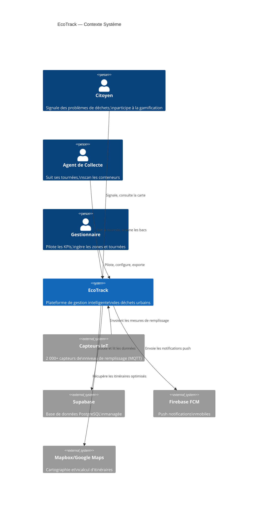
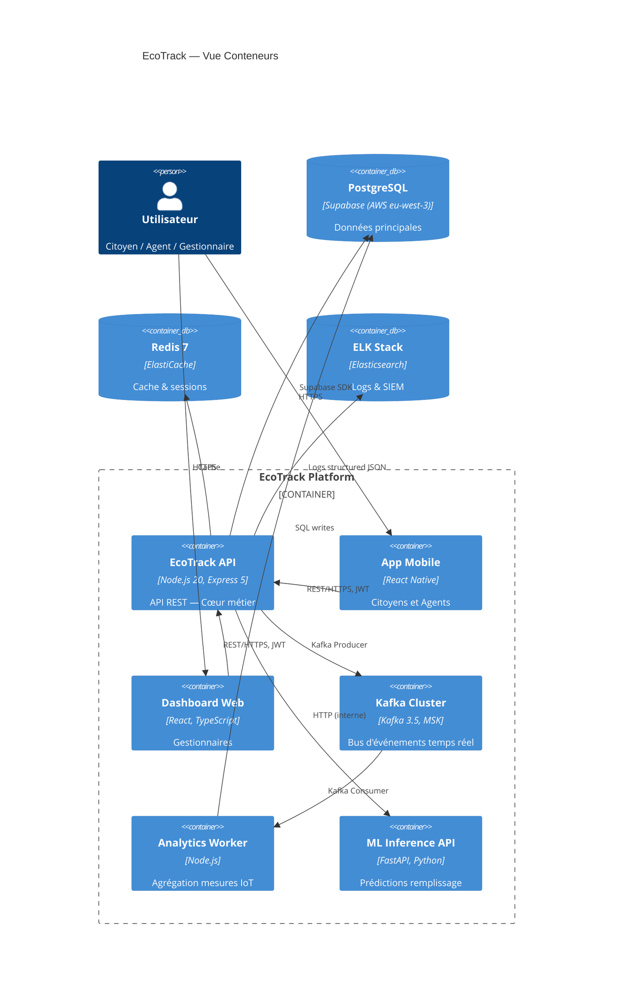
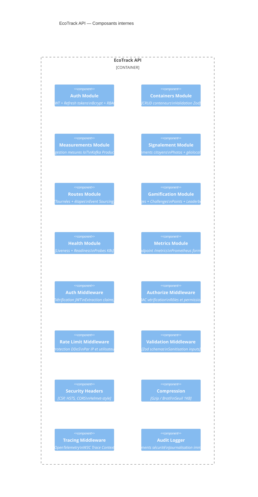
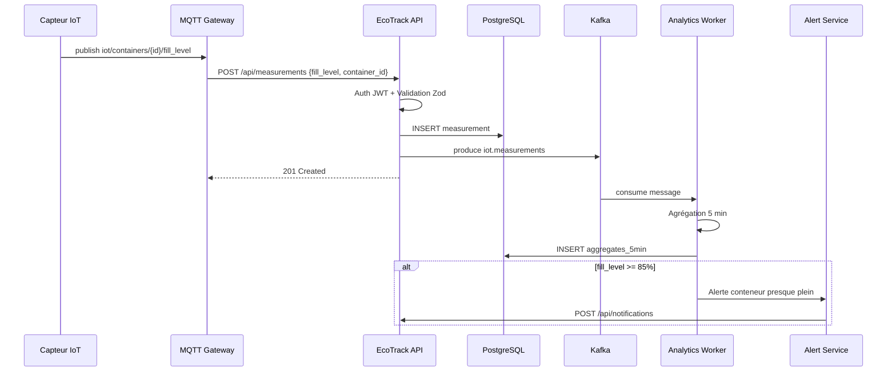

# Diagrammes d'Architecture C4 — EcoTrack

## Niveau 1 — Contexte Système

```mermaid
C4Context
  title EcoTrack — Contexte Système

  Person(citoyen, "Citoyen", "Signale des problèmes de déchets,\nparticipe à la gamification")
  Person(agent, "Agent de Collecte", "Suit ses tournées,\nscan les conteneurs")
  Person(gestionnaire, "Gestionnaire", "Pilote les KPIs,\ngère les zones et tournées")

  System(ecotrack, "EcoTrack", "Plateforme de gestion intelligente\ndes déchets urbains")

  System_Ext(capteurs, "Capteurs IoT", "2 000+ capteurs de\nniveau de remplissage (MQTT)")
  System_Ext(supabase, "Supabase", "Base de données PostgreSQL\nmanagée")
  System_Ext(fcm, "Firebase FCM", "Push notifications\nmobiles")
  System_Ext(maps, "Mapbox/Google Maps", "Cartographie et\ncalcul d'itinéraires")

  Rel(citoyen, ecotrack, "Signale, consulte la carte")
  Rel(agent, ecotrack, "Suit la tournée, scanne les bacs")
  Rel(gestionnaire, ecotrack, "Pilote, configure, exporte")
  Rel(capteurs, ecotrack, "Envoient les mesures de remplissage")
  Rel(ecotrack, supabase, "Stocke et lit les données")
  Rel(ecotrack, fcm, "Envoie les notifications push")
  Rel(ecotrack, maps, "Récupère les itinéraires optimisés")
```

## Niveau 2 — Conteneurs

```mermaid
C4Container
  title EcoTrack — Vue Conteneurs

  Person(user, "Utilisateur", "Citoyen / Agent / Gestionnaire")

  Container_Boundary(ecotrack, "EcoTrack Platform") {
    Container(api, "EcoTrack API", "Node.js 20, Express 5", "API REST — Cœur métier")
    Container(mobile, "App Mobile", "React Native", "Citoyens et Agents")
    Container(dashboard, "Dashboard Web", "React, TypeScript", "Gestionnaires")
    Container(kafka, "Kafka Cluster", "Kafka 3.5, MSK", "Bus d'événements temps réel")
    Container(worker, "Analytics Worker", "Node.js", "Agrégation mesures IoT")
    Container(ml_api, "ML Inference API", "FastAPI, Python", "Prédictions remplissage")
  }

  ContainerDb(db, "PostgreSQL", "Supabase (AWS eu-west-3)", "Données principales")
  ContainerDb(redis, "Redis 7", "ElastiCache", "Cache & sessions")
  ContainerDb(elk, "ELK Stack", "Elasticsearch", "Logs & SIEM")

  Rel(user, mobile, "HTTPS")
  Rel(user, dashboard, "HTTPS")
  Rel(mobile, api, "REST/HTTPS, JWT")
  Rel(dashboard, api, "REST/HTTPS, JWT")
  Rel(api, kafka, "Kafka Producer")
  Rel(api, db, "Supabase SDK")
  Rel(api, redis, "Cache")
  Rel(kafka, worker, "Kafka Consumer")
  Rel(worker, db, "SQL writes")
  Rel(api, ml_api, "HTTP (interne)")
  Rel(api, elk, "Logs structured JSON")
```

## Niveau 3 — Composants (API EcoTrack)

```mermaid
C4Component
  title EcoTrack API — Composants internes

  Container_Boundary(api, "EcoTrack API") {
    Component(auth, "Auth Module", "JWT + Refresh tokens\nBcrypt + RBAC")
    Component(containers, "Containers Module", "CRUD conteneurs\nValidation Zod")
    Component(measurements, "Measurements Module", "Ingestion mesures IoT\nKafka Producer")
    Component(signalement, "Signalement Module", "Signalements citoyens\nPhotos + géolocalisation")
    Component(routes, "Routes Module", "Tournées + étapes\nEvent Sourcing")
    Component(gamification, "Gamification Module", "Badges + Challenges\nPoints + Leaderboard")
    Component(health, "Health Module", "Liveness + Readiness\nProbes K8s")
    Component(metrics, "Metrics Module", "Endpoint /metrics\nPrometheus format")

    Component(auth_mw, "Auth Middleware", "Vérification JWT\nExtraction claims")
    Component(authz_mw, "Authorize Middleware", "RBAC vérification\nRôles et permissions")
    Component(rate_mw, "Rate Limit Middleware", "Protection DDoS\nPar IP et utilisateur")
    Component(valid_mw, "Validation Middleware", "Zod schemas\nSanitisation inputs")
    Component(sec_mw, "Security Headers", "CSP, HSTS, CORS\nHelmet-style")
    Component(compress_mw, "Compression", "Gzip / Brotli\nSeuil 1KB")
    Component(trace_mw, "Tracing Middleware", "OpenTelemetry\nW3C Trace Context")
    Component(audit, "Audit Logger", "Événements sécurité\nJournalisation immuable")
  }
```

## Diagramme de Flux — Ingestion IoT

```mermaid
sequenceDiagram
  participant Sensor as Capteur IoT
  participant MQTT as MQTT Gateway
  participant API as EcoTrack API
  participant DB as PostgreSQL
  participant Kafka as Kafka
  participant Worker as Analytics Worker
  participant Alert as Alert Service

  Sensor->>MQTT: publish iot/containers/{id}/fill_level
  MQTT->>API: POST /api/measurements {fill_level, container_id}
  API->>API: Auth JWT + Validation Zod
  API->>DB: INSERT measurement
  API->>Kafka: produce iot.measurements
  API-->>MQTT: 201 Created
  Kafka->>Worker: consume message
  Worker->>Worker: Agrégation 5 min
  Worker->>DB: INSERT aggregates_5min
  alt fill_level >= 85%
    Worker->>Alert: Alerte conteneur presque plein
    Alert->>API: POST /api/notifications
  end
```
